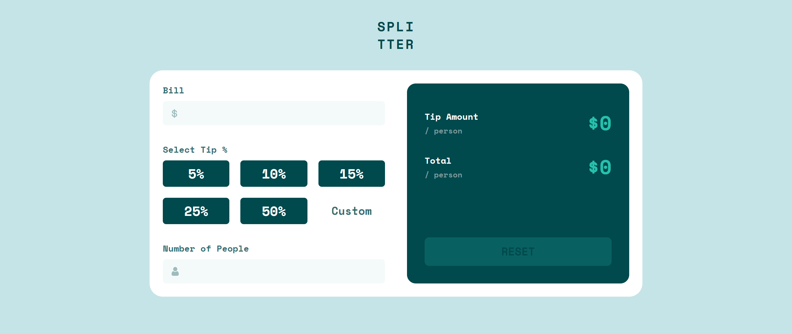
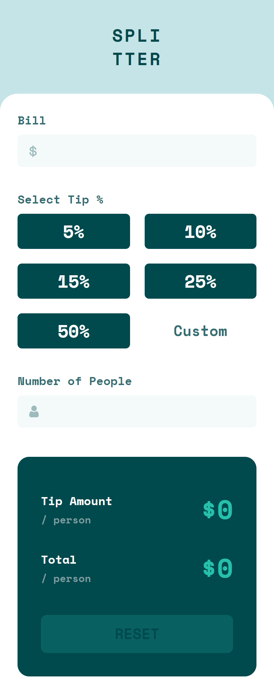

# Frontend Mentor - Tip calculator app solution

This is a solution to the [Tip calculator app challenge on Frontend Mentor](https://www.frontendmentor.io/challenges/tip-calculator-app-ugJNGbJUX). Frontend Mentor challenges help you improve your coding skills by building realistic projects.

## Table of contents

- [Overview](#overview)
  - [The challenge](#the-challenge)
  - [Screenshot](#screenshot)
    - [Desktop](#desktop)
    - [Mobile](#mobile)
  - [Links](#links)
- [My process](#my-process)
  - [Built with](#built-with)
  - [Useful resources](#useful-resources)

## Overview

### The challenge

Users should be able to:

- View the optimal layout for the app depending on their device's screen size
- See hover states for all interactive elements on the page
- Calculate the correct tip and total cost of the bill per person

### Screenshot

#### Desktop

#### Mobile

### Links

- Solution URL: [Here](https://www.frontendmentor.io/solutions/tip-calculator-app-tailwind-css-and-vanilla-javascript-GY85-k9-m)
- Live Site URL: [Here](https://jol-tip-calculator-app.netlify.app/)

## My process

### Built with

- Semantic HTML5 markup
- Mobile-first workflow
- [Tailwind CSS](https://tailwindcss.com/) - CSS Library

### Useful resources

- [Tailwind CSS](https://tailwindcss.com/)
- [Stack Overflow](https://stackoverflow.com/)

## Author

- Website - [jolangker](https://jolangker.netlify.app)
- Frontend Mentor - [@jolangker](https://www.frontendmentor.io/profile/jolangker)
- Instagram - [@thoriqqq1](https://www.instagram.com/thoriqqq1)
